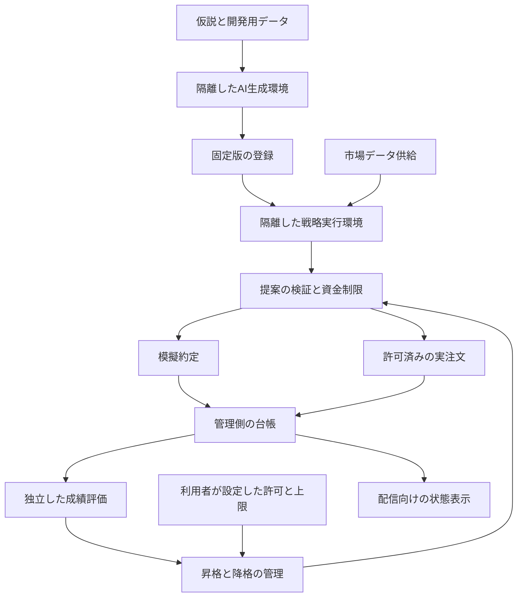

# PAPER戦略の自由生成・隔離実行・本運用への昇格設計

- 状態: 設計案。実装・配備・実資金投入は未実施。
- 作成日: 2026-09-12
- 調査基準: docich main `f6dfa867d030c96c63299964988cf745d0308a29`。
- 対応する要望: 既存戦略の組み合わせに加え、AIが独自の戦略を作る。収益の再現性を検証できた版を本運用へ採用する。
- 今回の範囲: 設計書とローカルの引き継ぎ記録。実行コード、実行設定、取引台帳、発注経路を変更しない。

## 1. 設計の決定事項

1. **戦略の計算方法は自由にする。** 独自指標、複数銘柄の関係、局面判定、状態を持つロジックを作成できる。既存の宣言型戦略も比較対象として残す。
2. **生成時と実行時の両方を隔離する。** 生成したコードを本体へ直接importしない。本運用への採用後も隔離を継続する。
3. **戦略は売買の提案を返す。** 市場データの供給、資金配分、約定、台帳、採点、昇格判断は外側の管理機構が担当する。
4. **採用単位は検証済みの固定版とする。** 名前が同じでもコード・設定・初期モデル等が変われば別版として評価する。
5. **昇格と降格を一体で設計する。** ペーパー合格、実資金利用の許可、少額本運用、段階増額はそれぞれ別の条件とする。
6. **情報不足は待機とする。** 低頻度戦略や相場条件を待つ戦略を、短期間に売買しなかっただけで不合格にしない。

この設計への合意は実資金投入の承認ではない。実装の初期段階ではlive経路を無効にし、PAPER候補の評価までを実現する。

## 2. 現在の実装と不足する部分

以下は調査基準コミットのコードを読んだ結果であり、VM上の稼働版・実効設定・取引成績の確認ではない。

| 現在の構成 | 確認した内容 | 本設計で追加するもの |
|---|---|---|
| `paper_improve.py` | 生成コードを使わず、指定した指標を組み合わせたJSONを生成する | 自由コードを生成する独立した経路 |
| `strategy_lab.py` | エントリー指標7種類、退出用の損益・保有時間、AND/OR条件を評価する | 独自の計算・記憶・銘柄横断ロジック |
| `strategy_store.py` / `strategy_runtime.py` | 保存した実験をworkerの各サイクルへ読み込む | 固定版の登録と、複数実験の独立した状態管理 |
| `worker.py` | 戦略候補を共通の配分処理とPaperBrokerへ渡す | 隔離runnerの提案を検証する境界 |
| `strategy_metrics.py` | 対象実験の売買だけを集計し、確定損益と確定損益ベースの最大下落を計算する | 手数料・含み損益を含む総資産評価と、独立した採用判定 |
| `persist_evaluation()` | `promotion_ready`なら候補JSONを保存する。実注文への接続はしない | 期限と根拠を持つ評価記録、許可、少額運用、降格 |

現在の`promotion_ready`は「売り約定20件以上・確定損益が正・profit factor 1.20以上・確定損益ベースの下落10%以下」である。この関数は手数料の列や未決済ポジションの時価を参照しない。売り約定件数も、独立した投資判断の数とは限らない。**このフラグだけで実資金を投入しない。**

また、現行の実験交代条件には20件の売り約定または48時間経過などがある。研究枠の交代と、本運用に必要な観測量は別にする。既存記録は保持し、後から新しい合格基準を満たした記録へ読み替えない。

コード根拠: [生成指示](https://github.com/azumag/docich/blob/f6dfa867d030c96c63299964988cf745d0308a29/src/docich/trading/paper_improve.py#L162-L196)、[交代条件](https://github.com/azumag/docich/blob/f6dfa867d030c96c63299964988cf745d0308a29/src/docich/trading/paper_improve.py#L263-L294)、[成績計算](https://github.com/azumag/docich/blob/f6dfa867d030c96c63299964988cf745d0308a29/src/docich/trading/strategy_metrics.py#L14-L108)、[候補保存](https://github.com/azumag/docich/blob/f6dfa867d030c96c63299964988cf745d0308a29/src/docich/trading/strategy_lab.py#L635-L648)。

## 3. 全体構成



`Live`は将来の構成要素であり、PAPER段階では接続しない。戦略runnerはこの図のGateを直接呼び出す権限を持たず、管理プロセスが回収した提案だけを審査する。

生成・実行の計算資源は、配信エンコーダ、音声、ゲーム、共通通知と分離する。最初の候補は専用Linux実行環境上のgVisor対応runnerとする。配置先、費用、利用できるCPUアーキテクチャ、必要ライブラリの互換性は実装前に実測する。現行VMで利用できるとは仮定しない。

## 4. サンドボックスと権限

### 4.1 生成環境

- AIは候補専用の作業領域でコード、補助ファイル、自己テストを自由に編集できる。
- 本体リポジトリ、他戦略、台帳、実運用設定、採点コード、秘密情報の保存場所を共有しない。
- LLM認証は外側の生成サービスが持つ。AIが操作できるツールは当該作業領域の編集と隔離テストに限定する。
- 外部調査は管理側の取得サービスを通す。取得した記事やツール出力を、権限変更や発注の指示として処理しない。
- 開発用のデータと成績は見せてよい。最終評価用の非公開期間と、他候補の非公開評価詳細は渡さない。
- 依存パッケージは固定した実行イメージで供給する。AIが指定したインストール処理やビルドスクリプトをホスト上で実行しない。

生成完了時にはプロセスを停止してから成果物を回収する。成果物はサイズ・件数・形式を制限し、通常ファイルだけを取り込む。絶対パス、親ディレクトリ参照、シンボリックリンク、ハードリンク、デバイス、実行フックを含むアーカイブ展開は拒否する。生成側が変更できない保存領域へ複製し、その内容から版の識別子を確定する。

### 4.2 実行環境

| 対象 | 境界 |
|---|---|
| 戦略コード・ライブラリ | 固定版を読み取り専用で供給 |
| 市場データ | 管理側が当該時点までに利用可能だったデータだけを供給 |
| 記憶・一時ファイル | 当該実行専用の一時領域。容量上限付きで終了時に廃棄。継続状態は受理したJSONだけ |
| 通信 | 戦略コードからの外部通信を遮断。ホストサービス・クラウドのmetadata endpointも対象 |
| 認証・環境変数 | 最小の許可リストから作成。ホスト環境を丸ごと引き継がない |
| OS権限 | 非特権ユーザー。権限昇格、ホストのPID/network namespace、管理socketを許可しない |
| CPU・メモリ・プロセス数 | 実行単位とrunner全体に上限を設定 |
| 時間・出力量・保存量 | 壁時計の期限、標準出力・ログ・一時領域・成果物の上限を設定 |
| 異常終了 | 当該実行の子プロセスを含め終了を確認し、失敗を記録。出力を採用しない |

資格情報、台帳、Docker socket、SSH agent、ホストのホームディレクトリをmountしない。必要なファイルと通信の制御は、gVisorを使う場合にも別途必要である。[gVisorのセキュリティモデル](https://gvisor.dev/docs/architecture_guide/security/)

資源上限は設定が有効であることを起動前に確認する。Dockerは既定でCPU・メモリの使用量を制限しないため、「コンテナで動いた」を合格条件にしない。[Dockerの資源制限](https://docs.docker.com/engine/containers/resource_constraints/)

初期の隔離検証用予算案は、1回の判断につき1 vCPU・メモリ512 MiB・プロセス32個・壁時計5秒、一時領域64 MiBとする。最大同時実行は2とし、入力サイズも含め総メモリ上限を別に設ける。これらは稼働設定ではなく実測用の仮値であり、超過を理由に制限を無効化しない。重い学習処理は別の研究用予算で行い、liveの判断期限を延ばす代用にしない。

OS隔離に失敗した場合は実行を拒否する。同じコードを通常のPythonプロセスで再試行するfallbackは設けない。構文検査、import、候補の自己テスト、モデルの復元も隔離の内側で行う。

## 5. 戦略との入出力契約

### 5.1 入力

入力は版付きのデータ構造とし、少なくとも次を持つ。

- 管理側が発行した`run_id`、判断時刻、データの締切時刻、乱数seed。
- 対象市場、価格・出来高の履歴、データの観測時刻と利用可能になった時刻。
- 自身の口座に帰属する残高、保有、未約定注文、直近の約定。これらの正本は管理側の台帳。
- 前回の有効な判断で確定した戦略状態と、そのリビジョン。
- 実行期限、許可されたデータの種類、当該実験に適用する売買制約。

初期版はPythonによる現物・買い持ち戦略を対象とする。計算は既存の7指標へ制限しない。銘柄横断の判断や状態遷移も許す。追加の板情報や複数時間足などは、管理側のデータ契約を拡張して供給する。足りないデータを戦略が任意のURLから取得する構成にはしない。

履歴全体のファイルを渡して「未来を読まないで」と指示する方式は採らない。過去評価時にはその判断時点で利用可能だった範囲だけを渡す。未確定足、ニュースの公開・取得遅延、当時の銘柄一覧も同じ基準で扱う。オンライン学習は、固定された学習手順がその時点までの入力だけを使う場合に限る。

### 5.2 出力

初期版は、許可市場ごとの希望保有量を`target_positions`として返す。構造の例は以下であり、取引の推奨値ではない。

```json
{
  "schema_version": 1,
  "target_positions": [],
  "state": {"phase": "observing"},
  "reason": "必要な観測が揃うまで保有を変更しない"
}
```

- 各要素は`symbol`と非負の`target_base_quantity`だけを持ち、数量は有限の十進文字列とする。
- 市場の省略はその市場の現状維持、数量ゼロの明示はその市場の保有解消の提案とする。空の配列は「売買の提案なし」であり、全売却ではない。
- ターゲットは当該実験に帰属する保有量。執行中の注文・部分約定と照合して差分を作るのは管理側である。
- `state`は初期版ではJSONのみ。ホスト上でpickle等を復元しない。`state`を含む応答全体は64 KiB、深さ16、提案市場数32、理由400文字を上限案とする。
- 応答は一つだけ受理する。重複キー、未知のキー、非有限値、負の数量、重複市場、許可外市場、期限超過、形式不正は全体を拒否する。
- 口座、paper/liveの指定、認証情報、発注ID、採点結果、昇格許可を出力に含められない。実験・版・口座の識別は管理側が付与する。

管理側が価格、最小数量、残高、注文予約、資金上限を用いて提案を検証する。戦略の希望数量や自己申告の期待利益は、そのまま発注権限にはならない。理由の文章は表示用としてエスケープし、命令として処理しない。

### 5.3 状態と再実行

管理側は`run_id`、入力・成果物の識別子、入力状態のリビジョン、有効な応答、判断結果を一組で保存する。構造検証済みの状態更新と提案記録は一つのトランザクションで確定する。資金制限による見送りも記録し、次の入力で実際の約定結果を返す。戦略が「提案したので約定した」と仮定しても台帳は変わらない。

タイムアウト・出力破損では状態を進めない。重複した`run_id`は保存済み判断を返し、注文を作り直さない。実注文の応答が不明な場合は既存注文の照合を先に行う。

判断ごとに新しい実行環境を作り、前回のプロセスや書き込み可能なファイルを使い回さない。これにより、失敗した判断が隠れたファイル状態だけを変更して次回へ影響することを防ぐ。初期版の継続状態の正本は、管理側が受理したJSONに限定する。

学習済みモデルなどJSONを超える状態は、初期版では追加機能として保留する。追加する場合も状態を当該版へ結び付け、容量・形式を制限し、復元コードは隔離内で実行する。

## 6. 固定版・実験・口座の分離

| 記録 | 内容と所有者 |
|---|---|
| `StrategyArtifact` | ソース・設定・初期状態・依存イメージ・入力契約の内容から識別。登録サービスだけが作成し、登録後は変更不可 |
| `Experiment` | artifact、仮説、対象市場、時間軸、データ供給の版、評価基準、開始時刻、開発系列、試行予算 |
| `DecisionReceipt` | 入力、状態、提案、検証結果、見送り理由。管理側が記録 |
| `EvaluationReport` | 対象版、データ締切、台帳・評価コード・コストモデルの版、指標、判定、期限 |
| `Authorization` | 利用者が許可した口座・対象・上限・有効期限。戦略や生成AIは変更不可 |
| `Deployment` | どの版をどの口座・資金枠で実行しているか。昇格管理が更新 |

同じ戦略名のv1が本運用中でも、v2は独立したペーパー実験として走る。外部で再学習した重み、計算を変える設定、入力変換、依存イメージを変更した場合は影響する評価をやり直す。固定した学習手順による通常の状態更新は、履歴を記録したうえで同じ版の動作とする。

ペーパーでは各実験と比較対象に独立した仮想口座を割り当てる。同じ入力と資金条件で比較し、他実験の保有を売れないようにする。複数の仮想口座の利益を一つの実口座の収益率として合算表示しない。

本運用で複数戦略が同一取引所口座を共有する場合は、中央台帳で戦略別の保有・未約定予約を管理する。各戦略の割当合計と実口座の残高を照合し、同じ資金を二重に割り当てない。売却可能量は自身に帰属する未予約分に制限する。

## 7. 多様性を維持する研究枠

研究枠は「既存の比較対象」「成績のよい候補の継続観測」「異なる発想の探索」に分ける。論理上の枠数とOS上の同時実行数は別であり、計算資源の範囲で順番に評価できる。

- 既存の宣言型戦略を再現可能な比較対象として固定する。売買しない現金保持も評価の基準に含める。
- 探索枠を継続的に確保し、直近利益の順だけで全枠を埋めない。
- 仮説、時間軸、入力データ、売買タイミング、保有期間、損益の相関で類似性を記録する。戦略名や説明の違いだけを多様性とみなさない。
- データ不足の候補は`insufficient_evidence`とし、必要な期間・相場・標本を表示する。研究予算が尽きた場合は`budget_exhausted`と記録し、性能不合格と区別する。
- 同じデータで試した失敗案、パラメータ変更、候補の派生関係も試行履歴へ残す。成功案だけを保存しない。
- 多様性は研究枠の配分と、本運用ポートフォリオ全体への追加効果を判断する材料にする。多様性が高いことを理由に資金制限や採用基準を免除しない。

## 8. 「安定して収益を出せる」の評価契約

将来の利益の保証はできない。ここでは、事前に固定した条件を満たす根拠が得られた状態を「ペーパー合格」と呼び、採用後も同じ管理機構で監視する。

### 8.1 開発・最終検証・将来観測の区分

1. **開発データ**: AIへ公開してよい。時系列順の複数期間で候補を比較し、失敗も含めて記録する。
2. **最終検証**: 候補の版、初期状態、主評価指標、終了時刻、試行群、判定基準を固定してから実施する。AIが未使用の評価データへ適応して再試行する経路を作らない。
3. **将来観測**: 版を固定した後に到来する市場データでペーパー運用を継続する。過去評価に合格しただけでは昇格しない。

時系列の境界には、最大保有期間や学習ラベルの重なりに応じた空白期間を設ける。学習済みモデルを使う場合は学習データの締切も固定する。最終検証に不合格だった候補を修正して同じ期間へ戻す場合、その期間は開発済みとして扱い、独立した証拠へ数えない。

多数の候補から最高成績を選ぶと、偶然の好成績が残りやすい。そのため、評価器は試行履歴と候補系列も受け取り、選択の影響を評価する。[Baileyほかの研究](https://www.davidhbailey.com/dhbpapers/overfitting.pdf)

初期方式は、候補数と終了時点を事前登録した試行群に対する一度の最終判定とする。主指標には相関を考慮した信頼区間を付け、複数候補の判定には多重比較補正を適用する。日々の途中成績を見て、よくなった瞬間を「合格日」として切り出さない。逐次的な早期合格を追加する場合は、別途、誤判定率を管理する評価方式を版管理する。損失・障害による早期停止は常時可能で、途中失敗として履歴へ残す。

観測延長は、事前に決めたデータ不足への対応だけに限定し、損益の良し悪しを延長条件にしない。独立性のない取引数を停止条件にする場合も、その停止規則を評価方式へ含める。事後的に終了条件を変えた結果は、元の一度の判定として扱わない。

### 8.2 損益と約定の計算

- 主指標は、現金と保有資産の時価を合わせ、手数料を含めた総資産の変化とする。確定損益だけで採用しない。
- 未決済資産も評価し、保守的な退出価格・退出コストを用いる。入出金や資金枠変更による増加は利益から除く。
- 手数料、スプレッド、遅延、板の厚さ、最小注文、数量刻み、部分約定、未約定、注文取消を反映する。コストを二重に引かないよう、各費用の記録箇所を固定する。
- 判断に使った終値で無条件に同時約定させず、判断後に執行可能だった市場データで約定を評価する。取引量や板の取得が不足する場合は、約定品質の評価不足として残す。
- 売買回数を増やすだけで標本数を水増しできないよう、部分約定や同じ相場に連動する取引を束ねる。時系列の依存を考慮した標本の十分性を判定する。
- 特定の大勝ち、単一銘柄、一つの相場局面への利益集中を計測する。局面限定戦略は、宣言した適用局面内での成績と、適用外で休む動作の双方を確認する。

ペーパーと本運用には、約定待ち順、遅延による価格変動、市場への影響などの差がある。少額本運用はこの差を検証する独立段階として置く。Alpacaの資料は差異の参考であり、同社の約定仕様をbitbankへ流用するものではない。[公式資料](https://docs.alpaca.markets/us/docs/paper-trading)

### 8.3 合格条件と未確定の数値

以下の値は、対象市場・時間軸・予定資金・観測可能な流動性に合わせて、評価開始前に管理側で設定する。AIが成績を見て閾値を緩めることはできない。

| 条件 | 設定・判定する内容 | 不足時 |
|---|---|---|
| 観測量 | 最小日数、有効標本数、必要な局面の観測量 | 待機 |
| コスト控除後の収益 | 純収益と、主指標の下限に関する事前基準 | 不合格または事前規定の観測延長 |
| 不確実性 | 信頼水準、時系列の依存の扱い、候補数補正 | 評価不能なら待機 |
| 損失 | 含み損を含む最大下落、日次損失、尾部損失 | 上限超過で停止 |
| 頑健性 | コスト増加・遅延・欠測・異なる期間での感度 | 不合格または適用範囲縮小の別実験 |
| 比較対象 | 現金保持および固定した既存戦略との同一条件比較 | 優位性の根拠不足を明示 |
| 集中 | 銘柄・期間・少数の取引への利益とリスクの集中 | 事前の上限に従う |
| 実行品質 | 期限遵守、データ鮮度、台帳整合、異常率 | 障害・隔離失敗を優先して停止 |
| 証拠の有効性 | 評価対象の版、データ、コストモデル、期限が一致 | 失効・再検証 |

現行の「20件・1.20・10%」を、この表の本運用向け既定値へ流用しない。低頻度戦略向けの長い観測期間を許しつつ、統計的な根拠が弱い状態を合格にしない。未知・欠測・NaNをゼロ損失や成功として補完しない。

金額・損失上限等は利用者の資金判断を必要とするため本設計で勝手に確定しない。必須値が未設定なら、評価レポートの生成までは行えても本運用の許可は発行できない。

## 9. 昇格・降格の状態遷移

状態は`Experiment`と`Deployment`へ記録する。同じartifactに複数の実験がある場合も、別実験の合格結果を自動転用しない。

| 状態 | 意味 | 次の段階へ進む条件 |
|---|---|---|
| `research` | AIが候補を作成中 | 成果物の固定と登録 |
| `sandbox_verified` | 隔離・入出力・資源制限の検証に合格 | 評価計画と独立した口座の作成 |
| `paper_validating` | 固定版で最終検証と将来観測中 | 必要な全評価が合格 |
| `paper_qualified` | 有効期限付きのPAPER合格報告あり | 実資金利用の許可、資金予約、稼働条件の確認 |
| `live_canary` | 少額の実資金で約定と収益を観測 | 所定の観測量・実コスト・損失条件を満たす |
| `live_active` | 許可済み上限の範囲で運用 | 次の増額も独立した期間の確認後に限る |
| `paused` | 新規のリスク増加を停止 | 停止原因解消・再評価・有効な許可・利用者の休止解除 |
| `quarantined` | 隔離違反や成果物改変などを検出 | 調査と新たな検証。自動復帰しない |
| `retired` | 評価・運用を終了 | 記録を保持。再開するなら別実験 |

`insufficient_evidence`、`budget_exhausted`、`evaluation_expired`等は判断理由として併記する。状態変更は前の状態・期待リビジョン・根拠IDを照合し、一度だけ記録する。同時に二つの管理処理が走っても重複配備・二重の資金割当を起こさない。

古い合格JSONが残っていても、それだけで昇格しない。評価レポートのartifact、実験ID、計算方式、終了時刻、有効期限と、現在の市場・コスト・実行環境の条件を再確認する。条件が変わったら失効させる。

本運用中の資金縮小は管理側が行い、完全停止の場合は`paused`へ移る。低下した成績を消して新しい開始日で再計算し、自動で昇格し直す運用は認めない。復帰に必要な条件は停止時点で記録する。

## 10. 本運用の許可と執行

### 10.1 許可の発行

初期設定は本運用への自動昇格を無効とする。少額運用を始める前に、対象版、評価根拠、取引口座、最大資金、損失上限、停止・退出方法を利用者が確認できる候補レポートを作る。

運用方針として、次の二方式を用意できる。

- `manual_per_version`: 候補ごとに特定の版と資金枠を許可する初期方式。
- `preauthorized_auto`: 利用者が事前に定めた対象範囲・評価基準・総資金枠・同時候補数・有効期限の内側だけで、管理機構が候補ごとの許可を発行する方式。

後者でも初回の資金利用方針の承認は必要であり、生成AIが許可範囲を拡張することはできない。許可は正確なartifact、実験、口座、予算を結び付け、失効・取消を確認できるようにする。評価用JSONに`approved: true`と書いても許可にはならない。

### 10.2 中央の執行機構

- 取引所認証は実注文を担当するサービスだけが保持する。戦略runnerと生成環境には渡さない。
- 発注ごとに有効な許可、固定版、口座、取引所の実残高、戦略別予約、全体の資金・銘柄・損失上限を再確認する。
- 未約定注文と部分約定を含めて資金を予約する。予約を解放するのは取消・失効・約定が確認できた後に限る。
- 再送時の発注IDは管理側が決める。送信後に応答が途切れたら照合し、不明な注文をもう一度発注しない。
- 出金・送金・口座設定変更は戦略の機能として公開しない。初期live対応も現物・買い持ちに限定し、信用・空売り・レバレッジ・原子的な複数市場執行は別設計とする。
- 少額段階と通常段階の間で成績を分けて表示する。増額段階ごとに流動性・価格ずれ・全体の集中リスクを確認し、金額だけを自動で指数増加させない。

### 10.3 停止と復帰

損失上限超過、データの期限切れ、異常な価格ずれ、注文・残高の不一致、runnerの隔離失敗、許可失効では、新規のリスク増加を止める。隔離違反や改変は対象版を隔離し、必要なら自由コード枠全体を止める。

既に出ている新規建ての未約定注文にも取消を要求し、取消と約定が競合した場合は取引所の現物を照合する。取消要求を送っただけで予約資金を解放しない。

停止は無条件の成行全売却と同義にしない。確認済みの保有を減らす退出専用経路を用意し、取消、部分約定、利用可能な流動性、事前の退出ルールに従って扱う。価格・残高・注文状態が不明な場合は、新しい注文を推測で作らず照合・通知する。通常の戦略runnerが停止しても、管理側の保有監視と退出管理は継続する。

利用者による休止、成績による休止、システム障害による休止は別々の理由として保存する。自動復帰は、自分が設定した障害休止だけを解除できる。利用者が設定した休止を解除しない。全体停止を解除しても、個別戦略を無条件に再稼働させない。

## 11. 配信コーナーと運用画面

配信向けには、戦略名、狙い、既存戦略との違い、版、段階、期間、コスト控除後の成績、含み損益、最大下落、残る条件を表示する。例として「PAPER検証中」「観測不足」「本運用候補」「少額本運用」「新規売買停止」を区別する。

- PAPERとLIVEの金額・成績を混ぜない。公開する実資金情報の粒度は別に設定する。
- 昇格できない理由を具体的に示す。標本不足、コスト負け、期限切れ、技術的失敗を一つの「失敗」へまとめない。
- 「候補を作った」「検証に合格した」「本運用へ採用した」を別イベントにする。候補保存だけで収益性が改善したと放送しない。
- 最終市場データ時刻、workerの最終成功時刻、評価締切、表示生成時刻を分ける。コーナーの正常終了を取引workerの健全性とみなさない。
- 音声・通知には許可した表示項目だけを渡す。自由文、例外出力、外部ニュースを機密情報や操作命令と混ぜない。
- コーナーの開始・終了、ゲーム切替は研究・取引の状態を変更しない。戦略の停止で配信エンコーダや共通音声を再起動しない。

## 12. 実装時の分割と既存機能との接続

以下は将来の責務分割であり、このタスクでファイルやサービスを実装したものではない。

| 責務 | 既存との接続と変更方針 |
|---|---|
| 成果物登録・実験管理 | `paper_improve.py`から候補を登録。宣言型と自由コード型を種別で分ける |
| 隔離runner・入出力検証 | `worker.py`から呼ぶ別プロセス境界。生成コードを`strategy_runtime.py`のプロセスへ読み込まない |
| 独立した口座・判断記録 | `ledger.py`周辺を拡張。旧台帳を保持し、新実験に旧成績を混ぜない |
| 市場時刻・約定品質 | `market_data.py`、鮮度管理、板情報を評価契約へ接続する |
| 成績評価 | `strategy_metrics.py`を拡張または別版の評価器へ移行。旧方式の結果は旧方式と明示 |
| 昇格管理 | `promotion_ready`を参考情報として扱い、新たな評価報告と許可から状態遷移を行う |
| 本運用執行 | 独立したlive broker。PAPERの設定変更だけで実発注へ切り替わらない構成 |
| 表示・ナレーション | 固定した状態スナップショットを既存の通知・表示経路へ渡す |

実装は次の順に分ける。

1. **隔離の実証**: 固定fixtureと故障する候補で権限・資源・終了処理を検証する。取引所接続なし。
2. **独立したPAPER口座**: 既存戦略を比較対象に、自由コードの判断を模擬売買へつなぐ。新機能は既定無効。
3. **再現可能な評価**: 時刻、コスト、含み損、試行履歴、固定版、合格報告を実装する。
4. **昇格候補の表示**: 許可を作らず、候補と不合格・待機の理由を運用画面に出す。
5. **少額本運用**: 別の実装レビューと利用者の資金利用承認を経て、許可・照合・退出を備えたlive brokerを接続する。
6. **許可内の自動化**: 少額実績から増額・縮小・停止・復帰の実動作を検証した後、事前許可方式を有効にできるようにする。

既存の組み合わせ型を直ちに置き換えない。移行中は旧経路の成績を保持し、自由コード経路が停止しても既存のPAPER観測と配信を継続できるようにする。

## 13. 受入れ条件

以下は実装後に行う検証であり、現時点で成功したテストではない。

| 検証 | 必須の結果 |
|---|---|
| ホストファイル・環境・認証・管理socketへのアクセス | 拒否。ホストと他戦略の内容・状態を変更できない |
| 外部通信・ホストへの接続・metadataへの接続 | 拒否。入力供給を迂回できない |
| 無限ループ・fork・大量ログ・ディスク消費 | 上限内で終了し、子プロセスが残らず、共通配信を巻き込まない |
| sandbox起動失敗 | 通常Pythonへのfallbackをせず、当該判断を不採用にする |
| 生成物のパス細工・登録中の書換え・依存フック | 登録拒否。ホストでコードを実行しない |
| JSON破損・重複キー・NaN・未知フィールド・期限切れ | 提案と状態を不採用にする |
| 空の提案・市場の省略 | 全売却や他市場の保有変更を起こさない |
| 将来の足・公開前ニュース・使用済み最終評価期間 | 独立した評価入力へ入らない |
| 売り分割・含み損放置・手数料無視 | 標本数や利益・下落評価を有利に偽れない |
| 他候補の保有・予約資金 | 利用できず、成績へ混入しない |
| 判断の再送・注文応答の消失・途中再起動 | 二重発注・二重約定・予約の消失を起こさない |
| 同時昇格・古い合格報告・許可失効・版の不一致 | 配備を拒否し、資金枠を二重に割り当てない |
| 成績悪化・注文不一致・全体停止・利用者の休止 | 新規リスクを止め、照合と許可された退出だけを続ける |
| 旧版live中の新しいAI改善案 | 旧版を上書きせず、新版をPAPERから評価する |
| 表示・コーナー終了・ゲーム切替 | PAPER/LIVEと時刻の意味を保ち、取引状態や共通配信PIDを不用意に変えない |

セキュリティ境界とlive執行の変更は独立レビューの対象にする。ローカルテスト、CI、VMへの配備、実機での隔離確認、取引所の注文・残高照合はそれぞれ別の完了条件として報告する。

## 14. 実装前に確定する項目

| 項目 | 現時点の扱い |
|---|---|
| gVisorの配置先・対応環境・費用 | 専用実行環境を第一候補として実測。インストールや契約は未実施 |
| 許可ライブラリと重い学習の必要性 | Pythonの固定イメージから開始。計測後に追加候補を評価 |
| 評価用データと約定モデル | 履歴の可用性・時刻精度・板情報を確認して版を固定 |
| 戦略ごとの観測期間・統計基準 | 時間軸別に設定。未設定なら合格を出さない |
| 本運用の口座・総資金・損失上限 | 未設定。設計合意だけでは実資金を投入しない |
| 許可方式 | 初期は版ごとの許可。事前許可内の自動化も実現できる設計 |
| 公開するLIVE情報 | 実資金導入前に、公開範囲を別に決める |

この設計書の完成条件は、自由度、隔離、固定版、成績評価、資金利用の許可、停止・復帰、実装の順序をレビューできる状態にすること。上表の運用値の決定、コード実装、本番配備、実資金投入は後続作業である。
