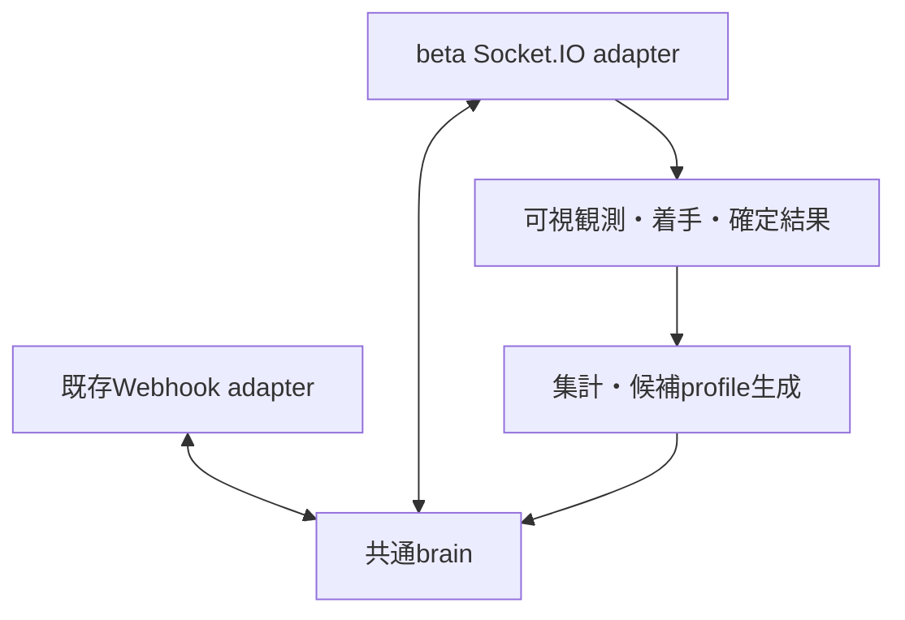

# ついたて将棋：複数サイトでの対局とbrain改善

## 構成

brainはサイトのURL、認証、Socket.IO、HTTP、Durable Objectを知りません。
自駒・自持駒・手番・王手の公開観測を受け、USIの指し手と評価特徴量を返す純粋関数です。
既存サイトはadapterでSFEN/CSAを変換し、betaはPlayerView/USIを変換します。
9×9の通常ついたてを対象とし、5五・ダーク・リレーは既存どおり非対応です。



`LEGACY_PROFILE` は王手が不明または無い時の従来の候補と選択順序を維持します。`LINEAR_PROFILE` は王・長距離駒・打ち・
任意成りを含む候補を作り、前進、中央寄り、成り、打ち、王移動、距離、反復の7特徴量で評価します。
自駒の遮蔽、二歩、行き所のない駒は候補から除外します。隠れた駒、王手回避、打ち歩詰めなど、
自分側の情報だけで判定できない合法性はサイトの審判に委ねます。

brain v2以降では、両profileとも公開観測で王手が確定し、残り試行予算が2以上の時に玉の移動候補を先に試します。
v3では玉の候補が全て拒否された場合、合駒や攻撃駒の捕獲が可能な位置への手を先に評価します。
viewerの `lastInfo=3`（相手が王手）と `lastInfo=2`（自分が王手中に反則）を
自分への王手として渡し、未知の通知では王手を推測しません。
Webhookでも同じ盤面で拒否された全候補を両profileで除外し、盤面が進んだら除外を解除します。
相手配置や利きを推測して合法手と断定する処理はありません。

`attemptBudget` は自分の公開反則情報から得る残り試行数です。
viewerは残反則数 `fouls[color] + 1`（0なら最後の1試行）、betaは使用反則数 `10 - fouls.you` を渡します。
brainは整数0..1001またはunknownのnullを受け付け、不正値は拒否、0では着手しません。
省略はnullで、以前の観測との互換性を保って玉のprobeを許します。
最後の1試行では無条件の玉優先を外し、王手への応答候補内でprofileの評価順を使います。
これは合法手の保証ではありません。相手の攻撃位置は公開されておらず、金の合駒等も審判に委ねます。

独立レビューの合成局面（自玉5i、金4h、香4i/6i、歩6h）で、残反則数0のlinear探索0が
v1では金4h5gを受理されるのに、初期v2では玉5i5hで反則負けになる退行を公式審判で再現しました。
予算追加後は金4h5gが受理され、残反則数1では玉の反則後に金の合駒を受理されます。
相手飛車と相手玉の位置は審判だけに渡しています。この合成退行はbrain・viewer・betaに公開回帰を追加しました。

brainの版は `tsuitate-brain-v3` です。旧版の進行中sessionへ途中から混在させず、
既存の版確認で停止します。配備する場合は対局終了後の境界を使ってください。
v1/v2の終了済み記録は引き続きoffline reviewの対象です。

### v3の王手中の応手順位

終了済みbeta対局1局を別に復元しました。対象側は受理19手・反則10回で、通常反則1回、
王手中の反則8回、反則上限到達1回でした。同局面で拒否された手への再訪はありませんでした。
調査時mainのv2・既定linear・記録のseedで対象側29試行すべてが一致しました。
棋譜自体にはbrain版がなく、この一致は実行版の直接証明とは区別します。

最後の王手局面には生成済みの合法な応手がありました。v2は玉の候補を使い切った後、
通常の前進評価へ戻り、王手への応答にならない手で残り予算を消費していました。
v3は自玉から縦・横・斜めの射線上にある行き先と、相手の桂馬が王手できる位置を
応答候補に残します。自駒に遮られた射線の先は除き、桂馬の位置判定では遮蔽を使いません。
両profileとも王手中は長距離移動・打ちを含めて候補を生成します。
玉以外の応答段階と最後の1試行では、この候補内で既存の評価・探索を使います。
自玉が一意に観測されない場合や応答候補が枯れた場合は従来の候補へ戻します。
相手駒の存在、攻撃位置、合法性、詰みを断定する処理ではありません。

完全盤面を審判だけに渡す固定局面のoffline比較では、記録と同じseedが
6反則で予算切れから4反則後に受理へ変わりました。匿名128 seedでも予算内受理は
0/128から128/128、平均反則は6.000から3.992になりました。
他の王手局面3件・384 seedは両版とも全受理で、反則数も一致しました。
旧11局の参考局面・1408 seedも両版とも全受理、反則912回で一致しました。
15局面の両profileについて、生成候補内の合法応手76件を幾何による絞り込みが
落とさないことを非公開審判で確認しました。

これは確認済み局面での診断評価で、独立したholdoutや対局継続の評価ではありません。
seed反復を別対局と数えず、実戦勝率の改善は主張しません。原棋譜・識別子・利用者情報は
非公開に保持し、公開回帰は両色の合成観測・反則feedback・桂馬捕獲・合駒だけです。
非公開数値は公開回帰だけでは再現できません。終局保存・通信制御はこの変更の対象外です。

### 王手応答のoffline評価

非公開の終了済み棋譜11局から、公式viewerの公開再生engineで474試行を復元しました。
受理356・反則118で、対象bot側は受理174・反則110でした。
対象botの反則は王手中99回・上限到達11回で、玉の試行は0回、同局面で拒否済み手の再試行は5回でした。
記録には実行brainの版がなく、共通brainの導入前の記録のため、現在版の退行と断定しません。
現在版でもlegacyの玉候補欠落、viewerの王手情報欠落、legacyの過去反則への再訪は再現しました。
linearの拒否済み候補累積除外は既に実装済みでした。

各局の最終連続反則に入る直前の局面を固定し、反則残数内に1手を受理されるか評価しました。
先頭8局面を開発用、末尾3局面を参考holdoutとする固定分割で、各局面128個の固定seedを使いました。
分割の事前固定を示すmanifestやコミットはありません。11局全体の敗因分類を先に確認しており、
末尾3局面は独立した盲検holdoutではありません。
比較前は調査開始時のmain `e7ab142e` のbrain v1・既定legacy、比較後は同じprofileのbrain v2です。
選択器へ渡す情報は当時の自駒・自持駒・公開王手・過去の自分の受理手と、
その応答試行で得た反則feedbackと公開反則数に基づく残り試行予算のみです。完全盤面は審判だけに渡します。

| 分割 | 局面数 | 予算内受理（前→後） | 平均反則（前→後） | 拒否済み手の再訪（前→後） |
| --- | ---: | ---: | ---: | ---: |
| 開発用 | 8 | 200/1024 → 1024/1024 | 8.407 → 0.609 | 489 → 0 |
| 参考holdout（非盲検） | 3 | 128/384 → 384/384 | 5.539 → 0.750 | 171 → 0 |

seed反復は同じ局面なので、独立した対局の標本数ではありません。
相手の続きは評価せず、実戦勝率の改善は未確認です。重みの学習・自動昇格は行っていません。
原棋譜・名前・時刻・paramと公式engineの複製は公開せず、公開回帰は小さな合成局面だけです。
上表の評価コードと棋譜はprivateに保持しており、公開テストだけでは上表の数値を再現できません。
初期局面での通常legacy選択順、両色・両profileの玉候補、王手通知、拒否の累積・候補枯渇を
`node --test test/brain.test.js test/worker.test.js` で確認できます。

viewerの一次資料: [棋譜パラメータと反則手数](https://tsuitateviewer.web.app/about)、
[公開棋譜再生画面](https://tsuitateviewer.web.app/tsuiban_react.html)。

最初のlinear profileは実戦で強さを測定していない基準です。長期の相手配置推定や探索エンジン、
LLMによる戦略コード書き換えは、この変更には含めていません。将来の思考実装は `src/brain/` に
追加し、観測とUSI出力の契約を守ることで両adapterを再利用できます。

## APIで確認した条件

一次資料：[公式bot接続ガイド](https://beta.tsuitate.info/bot-api)（2026-10-03 UTC確認）。

- Socket.IOのWebSocketで `https://beta.tsuitate.info` へ接続し、`auth.token` で認証します。
- 自分の駒・持駒・時計・反則回数だけが届きます。相手の身元も対局中は非公開です。
- 300秒＋1手3秒、反則は累計10回、切断は60秒で負け。同時対局は1局です。
- ランダムマッチを繰り返します。同一所有者のBOT同士、および所有者と自分のBOTは対戦しません。
- 専用BOTとトークンは、人間アカウントのマイページ→BOT管理で作成します。

## WebUIからの手動1局

Worker版はWebUIの「1局開始」で、明示runごとに最大1局です。次の手動開始は終局記録保存・socket終了・alarm削除後だけ可能で、自動反復しません。同じrunIdの再送は再募集せず、旧runIdの停止も現runへ作用しません。不明・paused状態は次局を開始しません。待機中の停止は退出、対局中の停止は現局完走・保存後に停止します。

既存operator/Host/Origin/CSRF/確認とWebUI→Worker専用HMACを通ります。Worker/WebUIとも利用可否の環境変数は不要です。既存secretと固定Worker URLの設定は必要で、認証未設定は拒否します。起動・状態取得・復元だけでは募集せず、明示startで1局を予約します。設定対象と保存先・ローカル検証は [README](README.md) を参照してください。flagを除くこの変更では実リソース作成・配備・secret設定・beta接続は行いません。

## Node runnerの準備と対局

Node.js 22.18以降を使います。リポジトリルートから：

```sh
cd workers/tsuitate-bot
npm install --no-audit --no-fund
mkdir -p ../../run/tsuitate-beta
npm run play:beta -- --export-profile ../../run/tsuitate-beta/base.json
```

実行環境へ `TSUITATE_BOT_TOKEN` を安全に設定してください。CLI引数やGitのファイルへ値を入れません。
以下はトークン設定後に外部対局を開始するコマンドです。

```sh
npm run play:beta -- \
  --games 20 \
  --directory ../../run/tsuitate-beta \
  --profile ../../run/tsuitate-beta/base.json
```

対局数を制限し、終了結果を保存してから3秒待ち、次の局へ参加します。
対戦相手の待機上限は既定120秒、`--queue-wait-seconds` で変更できます。
初回接続に成功しない場合も期限を設け、接続エラーの本文やトークンは出力しません。
Node runnerは任意の既存ホストで起動する独立プロセスで、WebUI/DOの手動1局とは別の実行経路です。この変更でVM service・スケジュールは起動しません。同じBotを両経路から同時に起動しないでください。

`SIGINT` / `SIGTERM` は次のキュー参加を止めます。対局中は着手を続け、終局・保存後に停止します。
待機列から抜ける際はACK後にも5秒間マッチ通知を受け付けます。APIにはACKと成立通知の相互順序の
明文化がないため、この猶予は任意に遅延する通知まで保証するものではありません。
実サイトでの初回受入では、キュー離脱とマッチ成立の競合も確認してください。

## 着手と再開の契約

- 1局面で未解決の送信は1手だけ。送信する**前**に観測・指し手・pendingを保存します。
- 成功ACKだけでは盤面を進めません。全量のPlayerViewで手数または反則回数の変化を確認します。
- 反則後はその局面で試した手を除外します。局面が進めば除外集合をリセットします。
- timeout、切断、プロセス再起動後も、同じ盤面を取得しただけでは不明な着手を再送しません。
- Socket.IOの着手再試行設定を使わず、接続がない間は送信しません。
- 対局ごとに別のSocket接続を作り、前局の遅延イベントやACKを次局へ持ち込みません。
- `state:null` は終局の証拠にしません。再同期や公開結果でも確認できなければpausedとして停止します。
- `game:active` の `{gameId:null}` は空のsnapshotとして無視し、待機中のキューや
  既知の対局を止めません。`match:found` の不正ID・色と、それ以外の不正なactive通知は停止します。
  `invalid_match_shape` は通知元・既知fieldの型・拒否stageだけを記録し、値や任意keyは出しません。
  `game:active` は公式botガイドに型定義がなく、公開ブラウザclientの補助通知と区別して扱います。
  `paused` の `hasGame:false` やcheckpoint不在だけで、サーバーに未成立とは判断しません。
  再実行前にサイトの既存局・待機状態・公開結果を確認してください。

Socket.IOの[到達保証](https://socket.io/docs/v4/delivery-guarantees/)と
[オフライン送信](https://socket.io/docs/v4/client-offline-behavior/)を踏まえた制御です。

同じ `--directory` を指定すると `checkpoint.json` の進行中対局を再開します。
profileは保存したものを使い、途中で別のprofileへ切り替えません。保存したbrain実装の版が
利用できない場合は `brain_version_unavailable` で停止します。元のbrain版、着手履歴、未確定の
送信記録をcheckpointに保持し、`interrupted` として学習・通常勝敗から除外します。
この状態で新しい対局には参加しません。旧実装を保持した環境へ戻すか、終局を確認してから
記録の扱いを判断してください。

1つのdirectoryは `runner.lock` で排他します。同じホストの所有PIDが確実に存在しない場合だけ、
次回の起動時に残存lockを回収します。PIDが生存中（再利用も含む）、権限などで生死を確認不能、
別ホスト、旧形式の場合は自動回収しません。同時回収は `runner.lock.guard` で直列化します。
回収処理自体がクラッシュしてguardが残った場合も停止します。手動解除は当該runnerと回収処理が
停止していることを確認してから、lock/guardファイルだけを取り除いてください。
checkpointや対局記録は削除しません。生きているプロセスを無条件に停止したり、ロックを自動削除したり
しない設計です。異なるdirectoryで同じBOTを同時起動しないでください。

## 対局記録と終局の確認

| ファイル | 内容 |
|---|---|
| `checkpoint.json` | 現在局のprofile・可視観測・送信中の手・再開位置 |
| `games/<hash>.json` | 終局した1局の正規化済み記録。site＋gameIdで一意 |
| `games.jsonl` | 上記から再構築する学習・集計用データ |
| `runner.lock` | その保存先を利用するrunnerの排他 |

記録には、サイト・ルール・先後・brain版・profile内容、各着手時に実際に見た観測、USI、評価特徴量、
受理/反則/不明、勝敗と終了理由、`communicationInterrupted`（通信・プロセス中断の有無）、
`resultSource` / `resultConfidence`（結果の出典と検証状態）、`validForTraining`（学習適格性）を残します。
トークン・rawエラー・終局で公開された相手盤面は含めません。
候補を選んだ時点の情報を再構成できるため、終局後の情報を対局中の判断へ混ぜずに分析できます。

`game:end` の詳細型とgameIdはガイドに明記されていません。runnerは通知を手がかりにして、
既知の対局IDの公開棋譜を読み、**ID・終局時刻・勝敗を照合**します。現在のサイトが公開する
`/games/<gameId>/__data.json` から結果に必要な参照だけを読み、盤面全体を復元しません。
実例：[公開終了済み棋譜](https://beta.tsuitate.info/games/TTYq1gmCD4xE)、
[同棋譜の公開データ](https://beta.tsuitate.info/games/TTYq1gmCD4xE/__data.json)。

この公開データ経路はサイトのSvelteKit実装に由来し、安定性を約束されたBOT APIではありません。
形式変更・取得失敗・ID不一致はunknownにし、勝敗を推測しません。PlayerViewで終局が確認できた局は
結果不明として保存し、終局自体が不明ならcheckpointを残してpausedにします。

終局の保存とJSONL更新の間で中断しても、次回の起動時にJSONLを再構築します。
同一局の一致する重複は集計から除き、異なる結果が混ざる重複はエラーにします。

## 結果からbrainだけを更新する

終局時点で公開結果が未反映ならunknownとして保存します。進行中checkpointがない次回のrunner
起動では、同じサイト・game IDの公開結果を再確認します。検証済みの確定結果を取得できた局だけ
unknownを更新し、元の可視観測・着手履歴・brain/profile・途中取得の分類は保持します。
既存の確定勝敗を上書きしません。進行中局の再開中はこの照会で時計を消費しません。

まず保存済みの成績を集計します。出力ファイルは新しい名前を指定します。

```sh
npm run train:brain -- report \
  --input ../../run/tsuitate-beta/games.jsonl \
  --output ../../run/tsuitate-beta/report-001.json
```

候補を作るときは、対局に使った基準profileも指定します。

```sh
npm run train:brain -- candidate \
  --input ../../run/tsuitate-beta/games.jsonl \
  --profile ../../run/tsuitate-beta/base.json \
  --output ../../run/tsuitate-beta/candidate-001.json \
  --report ../../run/tsuitate-beta/candidate-001-training.json
```

候補生成は、同じ基準profileで指した局のうち、終局結果が既知で全履歴を持つ対局だけを使います。
切断による勝敗、通信・プロセス中断、途中から取得した対局、結果不明を除外し、学習側に既定10局以上必要です。
再接続後に公式の詰み・時間切れ結果を確認しても、中断の事実は消しません。実際の勝敗と終了理由は
保存したまま通常勝敗・学習から除外します。中断属性や出典がない旧記録も検証不能として除外し、
`unverifiedResult` に集計します。
サイト・ルール・先後・brain版の各層内で勝敗と行動特徴量の関連を計算し、反則を減点します。
各重みの更新幅は既定で最大0.05です。候補を作る根拠が足りなければエラーにし、元のprofileは変えません。

データの20%を、サイト＋対局IDのハッシュで固定した検証用に分けます。候補生成には使用しません。
同じデータの順序変更や重複で、この分割は変わりません。勝敗の関連から作る小幅な候補であり、
生成だけで棋力向上を証明するものではありません。

次に、新旧profileを無作為に選んで外部対局を行います。選択は対局開始前で、1局中は固定です。

```sh
npm run play:beta -- \
  --games 50 \
  --directory ../../run/tsuitate-beta \
  --profile ../../run/tsuitate-beta/base.json \
  --profile ../../run/tsuitate-beta/candidate-001.json

npm run train:brain -- report \
  --input ../../run/tsuitate-beta/games.jsonl \
  --output ../../run/tsuitate-beta/comparison-001.json \
  --baseline ../../run/tsuitate-beta/base.json \
  --candidate ../../run/tsuitate-beta/candidate-001.json \
  --training-report ../../run/tsuitate-beta/candidate-001-training.json
```

比較は候補生成時に保存した分割とprofileハッシュを使います。学習済みデータを、別seedの検証用データ
として扱うことはできません。勝率、引き分けを半勝とした成績、反則、終了理由を分け、候補側の
実戦データがなければ改善の証拠なしと表示します。相手や時間帯は完全には統制されていないため、
比較は観測結果として読みます。候補の自動昇格はしません。

同じIDでも重みが変われば別ハッシュ、同じ重みに名前を付け替えただけなら同じハッシュです。
他サイトでもprofile JSONを共用できますが、成績はサイト・ルールごとに分けて評価します。

## 既存Webhookへ候補を適用する場合

候補のJSON本文をWorkerの `BRAIN_PROFILE_JSON` に設定すると、新規対局から使います。
既存のrequestId/HMAC/保存先/HTTP応答形式を変更する必要はありません。
設定が不正なら `503 invalid_brain_profile` とし、黙って別の戦略へ切り替えません。
設定変更前から進行中の局と、保存済みの再送応答は旧profileのままです。

Webhook側ではprofileを保存しますが、配備をまたいだbrain実装版の固定はまだ未対応です。
この要件を満たすまで、この基盤変更を本番へ統合しないでください。

この変更は設定・配備を自動で実行しません。新しいWebhook `game_end` の終局棋譜保存と
改善用データへの接続は別の変更で対応します。この基盤だけではWebhook側の成績を
学習データへ変換しません。
現在の自動収集はbeta経路で行い、生成したbrain/profileを両経路で利用します。

## 検証と残る受入

```sh
npm test
npm run build:cf
```

単体・擬似Socket.IOテストは、ACK/盤面の先後、反則の重複、切断、プロセス復元、送信前保存失敗、
旧局の終局通知、離脱と成立の競合、未知情報の除去、候補生成・検証データ分離を確認します。
`build:cf` は従来のbuild・workerd・生成bundle検証も実行し、配備はしません。

この変更はBOTトークン設定、実対局、ホスト常駐化、Cloudflare実設定変更を行いません。WebUI操作カードとローカル接続fixtureまでを検証し、配信画面への対局映像接続は対象外です。将来の実対局には改めてownerの1局許可が必要です。
