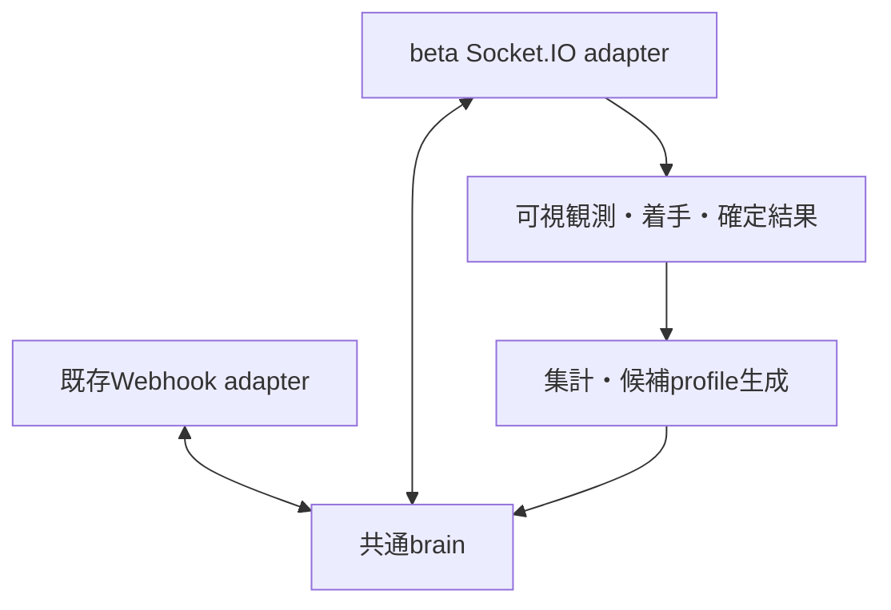

# ついたて将棋：複数サイトでの対局とbrain改善

## 構成

brainはサイトのURL、認証、Socket.IO、HTTP、Durable Objectを知りません。
自駒・自持駒・手番・王手の公開観測を受け、USIの指し手と評価特徴量を返す純粋関数です。
既存サイトはadapterでSFEN/CSAを変換し、betaはPlayerView/USIを変換します。
9×9の通常ついたてを対象とし、5五・ダーク・リレーは既存どおり非対応です。



`LEGACY_PROFILE` は従来の候補と選択順序を維持します。`LINEAR_PROFILE` は王・長距離駒・打ち・
任意成りを含む候補を作り、前進、中央寄り、成り、打ち、王移動、距離、反復の7特徴量で評価します。
自駒の遮蔽、二歩、行き所のない駒は候補から除外します。隠れた駒、王手回避、打ち歩詰めなど、
自分側の情報だけで判定できない合法性はサイトの審判に委ねます。

最初のlinear profileは実戦で強さを測定していない基準です。長期の相手配置推定や探索エンジン、
LLMによる戦略コード書き換えは、この変更には含めていません。将来の思考実装は `src/brain/` に
追加し、観測とUSI出力の契約を守ることで両adapterを再利用できます。

## APIで確認した条件

一次資料：[公式bot接続ガイド](https://beta.tsuitate.info/bot-api)（2026-10-03 UTC確認）。

- Socket.IOのWebSocketで `https://beta.tsuitate.info` へ接続し、`auth.token` で認証します。
- 自分の駒・持駒・時計・反則回数だけが届きます。相手の身元も対局中は非公開です。
- 300秒＋1手3秒、反則は累計10回、切断は60秒で負け。同時対局は1局です。
- ランダムマッチを繰り返します。同一所有者のBOT同士、および所有者と自分のBOTは対戦しません。
- 専用BOTとトークンは、人間アカウントのマイページ→BOT管理で作成します。

## 準備と対局

Node.js 22.18以降を使います。リポジトリルートから：

```sh
cd workers/tsuitate-bot
npm install --no-audit --no-fund
mkdir -p ../../run/tsuitate-beta
npm run play:beta -- --export-profile ../../run/tsuitate-beta/base.json
```

実行環境へ `TSUITATE_BOT_TOKEN` を安全に設定してください。CLI引数やGitのファイルへ値を入れません。
以下はトークン設定後に外部対局を開始するコマンドです。

```sh
npm run play:beta -- \
  --games 20 \
  --directory ../../run/tsuitate-beta \
  --profile ../../run/tsuitate-beta/base.json
```

対局数を制限し、終了結果を保存してから3秒待ち、次の局へ参加します。
対戦相手の待機上限は既定120秒、`--queue-wait-seconds` で変更できます。
初回接続に成功しない場合も期限を設け、接続エラーの本文やトークンは出力しません。
Node runnerは任意の既存ホストで起動する独立プロセスです。Cloudflare WorkerへSocket.IOの常駐
クライアントを組み込まず、この変更でVM service・配信コーナー・スケジュールは起動しません。

`SIGINT` / `SIGTERM` は次のキュー参加を止めます。対局中は着手を続け、終局・保存後に停止します。
待機列から抜ける際はACK後にも5秒間マッチ通知を受け付けます。APIにはACKと成立通知の相互順序の
明文化がないため、この猶予は任意に遅延する通知まで保証するものではありません。
実サイトでの初回受入では、キュー離脱とマッチ成立の競合も確認してください。

## 着手と再開の契約

- 1局面で未解決の送信は1手だけ。送信する**前**に観測・指し手・pendingを保存します。
- 成功ACKだけでは盤面を進めません。全量のPlayerViewで手数または反則回数の変化を確認します。
- 反則後はその局面で試した手を除外します。局面が進めば除外集合をリセットします。
- timeout、切断、プロセス再起動後も、同じ盤面を取得しただけでは不明な着手を再送しません。
- Socket.IOの着手再試行設定を使わず、接続がない間は送信しません。
- 対局ごとに別のSocket接続を作り、前局の遅延イベントやACKを次局へ持ち込みません。
- `state:null` は終局の証拠にしません。再同期や公開結果でも確認できなければpausedとして停止します。

Socket.IOの[到達保証](https://socket.io/docs/v4/delivery-guarantees/)と
[オフライン送信](https://socket.io/docs/v4/client-offline-behavior/)を踏まえた制御です。

同じ `--directory` を指定すると `checkpoint.json` の進行中対局を再開します。
profileは保存したものを使い、途中で別のprofileへ切り替えません。brain実装の版が更新された
場合は対局を継続し、混在した局を学習・成績比較から除外します。

1つのdirectoryは `runner.lock` で排他します。クラッシュ後にロックが残った場合は、当該runnerが
停止していることと、記録内PIDが稼働していないことを確認してから、ロックファイルだけを取り除きます。
checkpointや対局記録は削除しません。生きているプロセスを無条件に停止したり、ロックを自動削除したり
しない設計です。異なるdirectoryで同じBOTを同時起動しないでください。

## 対局記録と終局の確認

| ファイル | 内容 |
|---|---|
| `checkpoint.json` | 現在局のprofile・可視観測・送信中の手・再開位置 |
| `games/<hash>.json` | 終局した1局の正規化済み記録。site＋gameIdで一意 |
| `games.jsonl` | 上記から再構築する学習・集計用データ |
| `runner.lock` | その保存先を利用するrunnerの排他 |

記録には、サイト・ルール・先後・brain版・profile内容、各着手時に実際に見た観測、USI、評価特徴量、
受理/反則/不明、勝敗と終了理由を残します。トークン・rawエラー・終局で公開された相手盤面は含めません。
候補を選んだ時点の情報を再構成できるため、終局後の情報を対局中の判断へ混ぜずに分析できます。

`game:end` の詳細型とgameIdはガイドに明記されていません。runnerは通知を手がかりにして、
既知の対局IDの公開棋譜を読み、**ID・終局時刻・勝敗を照合**します。現在のサイトが公開する
`/games/<gameId>/__data.json` から結果に必要な参照だけを読み、盤面全体を復元しません。
実例：[公開終了済み棋譜](https://beta.tsuitate.info/games/TTYq1gmCD4xE)、
[同棋譜の公開データ](https://beta.tsuitate.info/games/TTYq1gmCD4xE/__data.json)。

この公開データ経路はサイトのSvelteKit実装に由来し、安定性を約束されたBOT APIではありません。
形式変更・取得失敗・ID不一致はunknownにし、勝敗を推測しません。PlayerViewで終局が確認できた局は
結果不明として保存し、終局自体が不明ならcheckpointを残してpausedにします。

終局の保存とJSONL更新の間で中断しても、次回の起動時にJSONLを再構築します。
同一局の一致する重複は集計から除き、異なる結果が混ざる重複はエラーにします。

## 結果からbrainだけを更新する

まず保存済みの成績を集計します。出力ファイルは新しい名前を指定します。

```sh
npm run train:brain -- report \
  --input ../../run/tsuitate-beta/games.jsonl \
  --output ../../run/tsuitate-beta/report-001.json
```

候補を作るときは、対局に使った基準profileも指定します。

```sh
npm run train:brain -- candidate \
  --input ../../run/tsuitate-beta/games.jsonl \
  --profile ../../run/tsuitate-beta/base.json \
  --output ../../run/tsuitate-beta/candidate-001.json \
  --report ../../run/tsuitate-beta/candidate-001-training.json
```

候補生成は、同じ基準profileで指した局のうち、終局結果が既知で全履歴を持つ対局だけを使います。
切断による勝敗、中断、途中から取得した対局、結果不明を除外し、学習側に既定10局以上必要です。
サイト・ルール・先後・brain版の各層内で勝敗と行動特徴量の関連を計算し、反則を減点します。
各重みの更新幅は既定で最大0.05です。候補を作る根拠が足りなければエラーにし、元のprofileは変えません。

データの20%を、サイト＋対局IDのハッシュで固定した検証用に分けます。候補生成には使用しません。
同じデータの順序変更や重複で、この分割は変わりません。勝敗の関連から作る小幅な候補であり、
生成だけで棋力向上を証明するものではありません。

次に、新旧profileを無作為に選んで外部対局を行います。選択は対局開始前で、1局中は固定です。

```sh
npm run play:beta -- \
  --games 50 \
  --directory ../../run/tsuitate-beta \
  --profile ../../run/tsuitate-beta/base.json \
  --profile ../../run/tsuitate-beta/candidate-001.json

npm run train:brain -- report \
  --input ../../run/tsuitate-beta/games.jsonl \
  --output ../../run/tsuitate-beta/comparison-001.json \
  --baseline ../../run/tsuitate-beta/base.json \
  --candidate ../../run/tsuitate-beta/candidate-001.json \
  --training-report ../../run/tsuitate-beta/candidate-001-training.json
```

比較は候補生成時に保存した分割とprofileハッシュを使います。学習済みデータを、別seedの検証用データ
として扱うことはできません。勝率、引き分けを半勝とした成績、反則、終了理由を分け、候補側の
実戦データがなければ改善の証拠なしと表示します。相手や時間帯は完全には統制されていないため、
比較は観測結果として読みます。候補の自動昇格はしません。

同じIDでも重みが変われば別ハッシュ、同じ重みに名前を付け替えただけなら同じハッシュです。
他サイトでもprofile JSONを共用できますが、成績はサイト・ルールごとに分けて評価します。

## 既存Webhookへ候補を適用する場合

候補のJSON本文をWorkerの `BRAIN_PROFILE_JSON` に設定すると、新規対局から使います。
既存のrequestId/HMAC/保存先/HTTP応答形式を変更する必要はありません。
設定が不正なら `503 invalid_brain_profile` とし、黙って別の戦略へ切り替えません。
設定変更前から進行中の局と、保存済みの再送応答は旧profileのままです。

この変更は設定・配備を自動で実行しません。既存Webhookに正式な終局通知契約がないため、
Webhook側の成績を推測で学習データへ変換する経路も追加していません。
現在の自動収集はbeta経路で行い、生成したbrain/profileを両経路で利用します。

## 検証と残る受入

```sh
npm test
npm run build:cf
```

単体・擬似Socket.IOテストは、ACK/盤面の先後、反則の重複、切断、プロセス復元、送信前保存失敗、
旧局の終局通知、離脱と成立の競合、未知情報の除去、候補生成・検証データ分離を確認します。
`build:cf` は従来のbuild・workerd・生成bundle検証も実行し、配備はしません。

実サイトのBOTトークン、実対局、ホスト常駐化、Cloudflare設定変更、配信画面・コーナー接続は未実施です。
最初の実対局では1局で認証→参加→先後→着手/反則→終局保存を確認し、その後に対局数を増やします。
